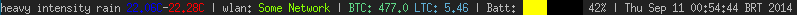

dwm-scripts
===========

Scripts for DWM working with FreeBSD OS.
The scripts are hard coded for a FreeBSD machine and can easily be modified
to work under anything.

Using the patch [dwm-ansistatuscolors](https://gist.github.com/la11111/4054818)

Features:

* Weather
* BTC ticker from BTC-e
* LTC ticker from BTC-e
* Cool battery widget
* Date

Example:

